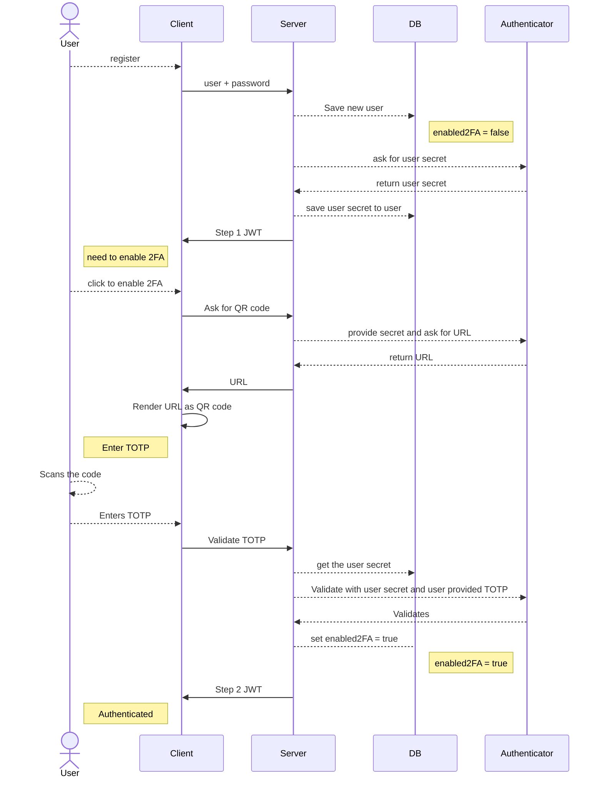

## Register

```mermaid
sequenceDiagram
Actor User
participant Client
participant Server
participant DB
participant Authenticator
User -->> Client: register
Client ->> Server: user + password
Server -->> DB: Save new user
note right of DB: enabled2FA = false
Server -->> Authenticator: ask for user secret
Authenticator -->> Server: return user secret 
Server -->> DB: save user secret to user
Server ->> Client: Step 1 JWT 
note left of Client: need to enable 2FA
User -->> Client: click to enable 2FA
Client ->> Server: Ask for QR code
Server -->> Authenticator: provide secret and ask for URL
Authenticator -->> Server: return URL
Server ->> Client: URL
Client ->> Client: Render URL as QR code
note left of Client: Enter TOTP
User -->> User: Scans the code
User -->> Client: Enters TOTP 
Client ->> Server: Validate TOTP
Server -->> DB: get the user secret
Server -->> Authenticator: Validate with user secret and user provided TOTP
Authenticator -->> Server: Validates
Server --> DB: set enabled2FA = true
note right of DB: enabled2FA = true
Server ->> Client: Step 2 JWT
note left of Client: Authenticated
```